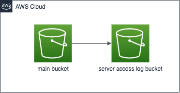

# AWS_BUCKET_WITH_SERVER_ACCESS_LOG_BUCKET

## Diagram

## Description

バケットとそのバケットに対するサーバーアクセスログバケットを作成するコードです

※ 便宜上、メインバケットとサーバーアクセスログバケットに区別します

オブジェクトがメインバケットに格納されると、そのログがサーバアクセスログに格納されます

この機構は監査のためであったり、セキュリティポリシーを持つ企業に対して役に立つと思います。

もちろん、メインバケットに対するログ分析にも効果的にも有用です。

## 仕様

### メインバケットはKMS(CMK)で暗号化されています

- マネージドKMSではなくCMKを利用しているのは、キーポリシーの変更ができるからです
- このリポジトリでは、lambdaやcloudwatchなどのawsサービスの処理結果を格納するためにメインバケットを使用することを想定しました
- KMSで暗号化する場合、これらのAWSサービスを許可するキーポリシーを設定する必要があります
- マネージドKMSではキーポリシーの編集ができないので、CMKを使用しています
- ただし、KMSでの暗号化は必須ではありません。プロジェクトの性質に応じて、SSEで暗号化するか、暗号化しないかを選択してください

### サーバーアクセスログバケットはSSE（Server-side Encryption）により暗号化されています。

- サーバーアクセスログバケットでは、KMSによる暗号化がサポートされていません

### ゴミファイルは60日後に削除されます

バケットのアップロードを途中で中断すると、その時点でアップロードされていたものは残ります。このゴミファイルを60日後に削除する設定をしています

両方のバケットにこの設定をしていますが、必要に応じて日数は変更してください。

### Lifecycle Rule

どちらのバケットも、以下のようなライフサイクルルールが設定されています

- オブジェクトが初めて保存されるとき、オブジェクトのストレージクラスは**Standard**になります
- オブジェクトが保存されてから**60**日後、そのオブジェクトのストレージクラスは**Standard-IA**に移行します
- オブジェクトが保存されてから**90**日後、オブジェクトのストレージクラスは**Glacier Flexible Retrieval**に移行します
- オブジェクトが保存されてから**180**日後、オブジェクトの保存クラスは**Glacier Flexible Retrieval**に移行します
- オブジェクトが保存されてから**365**日後にオブジェクトは**削除**されます

この設定は、必要に応じて変更することが可能です。
