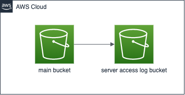

# AWS_BUCKET_WITH_SERVER_ACCESS_LOG_BUCKET

## Diagram

## Description

These codes will create a bucket and the server access log for that bucket.

※ For convenience, I will distinguish between the main bucket and the server access log bucket.

When an object is stored in the main bucket, its log is stored in the server access log bucket.

This mechanism would be useful for companies with auditing and security policies that require logs to be kept.

Of course, it will also be useful to analyze logs against buckets.

## Specification

### Main bucket is encrypted with KMS (CMK).
  - The reason why I am using CMK encryption instead of managed kms is because I can change the key policy.
  - In this repository, I assumed that the main bucket would be used to store the processing results of aws services such as lambda and cloudwatch.
  - For encryption in KMS, you need to configure the key policy to allow these AWS services.
  - Since you cannot edit the key policy in managed kms, I use CMK.
  - However, encryption in kms is not mandatory. Depending on the nature of your project, you can choose to encrypt with SSE or without encryption.

### Also, Server access log bucket is encrypted with SSE(Server-side encryption).
  - This is because encryption with kms is not supported in the server access log bucket.

### Garbage files will be deleted after 60 days.

If you interrupt the upload of a bucket in the middle, what was uploaded at that point will remain. I have a setting to delete this garbage file after 60 days.

I have this set up for both buckets, but you can change the number of days if you need to.

### Lifecycle Rule

Both buckets are configured with the follwing lifecycle rules.

- The first time an object is stored, its storage class will be **Standard**.
- **60** days after the object is stored, the storage class of the object will be moved to **Standard-IA**.
- **90** days after the object is stored,  the storage class of the object will be moved to **Glacier Flexible Retrieval**
- **180** days after the object is stored,  the storage class of the object will be moved to **Deep Achive Glacier**
- **365** days after the object is stored, the object the object will be deleted.

This setting can also be changed if necessary.

## In the end

I'm not very good at English.

This text was helped by DeepL.

Thank you for reading.